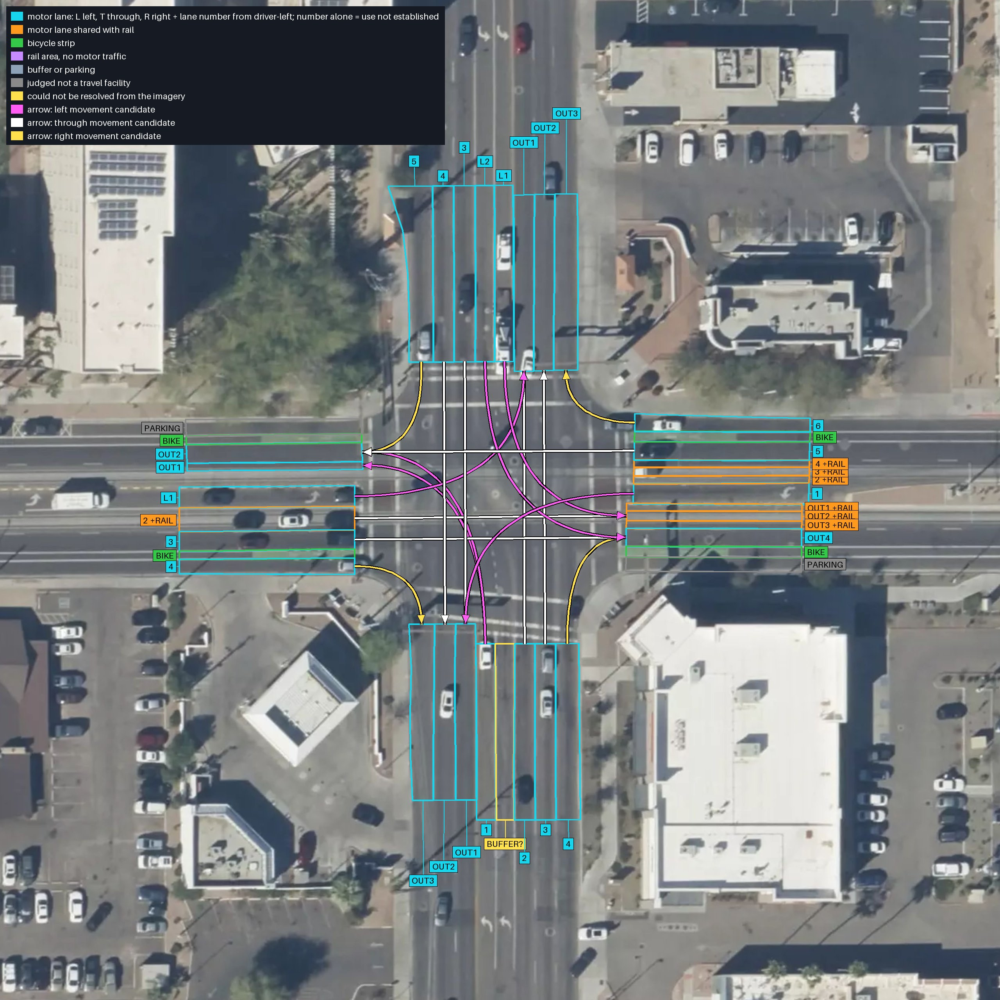
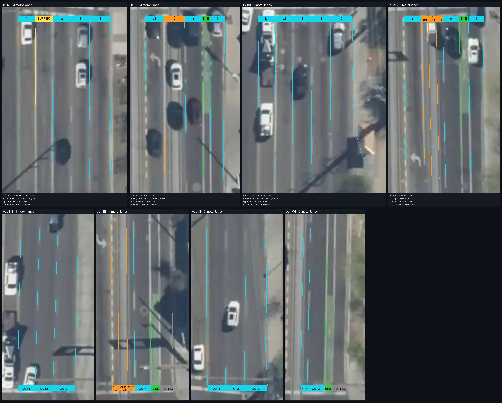
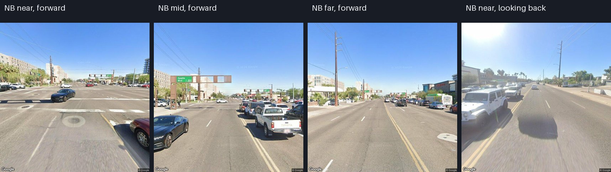
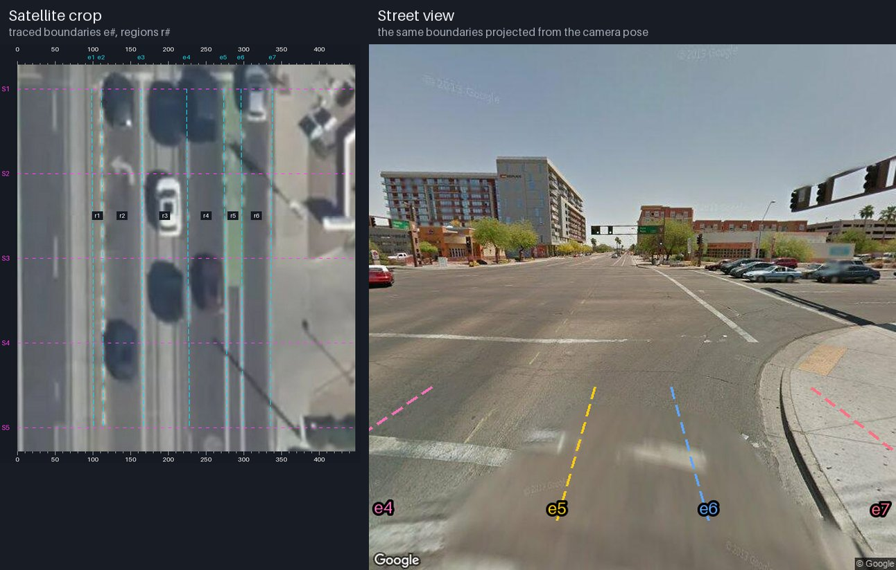
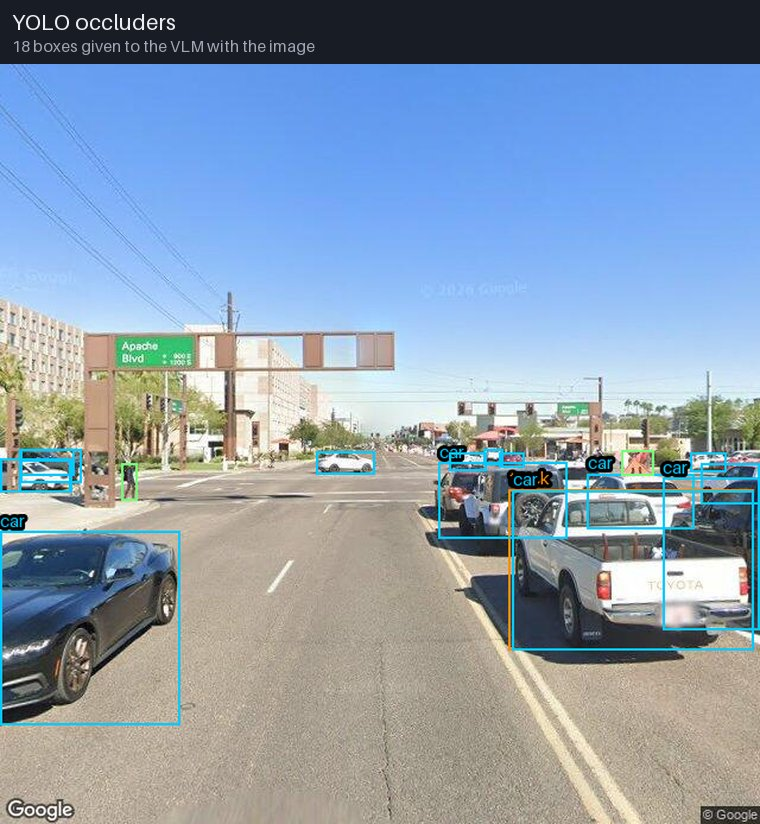
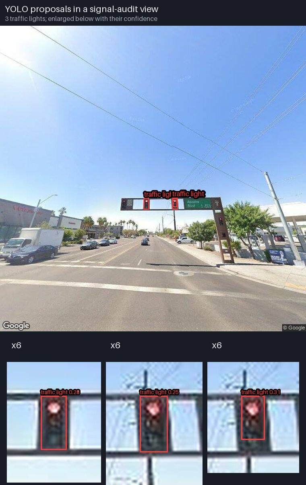
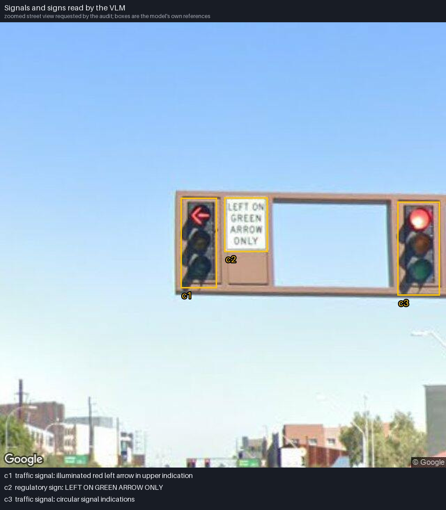
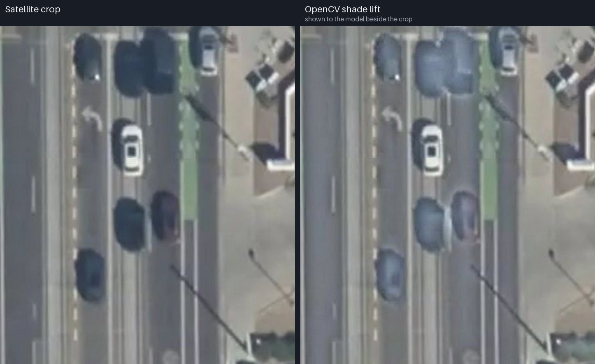
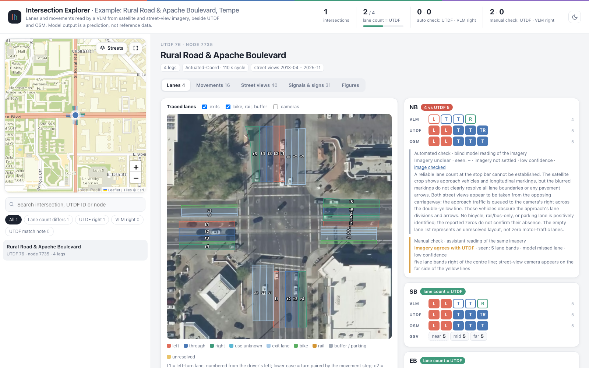
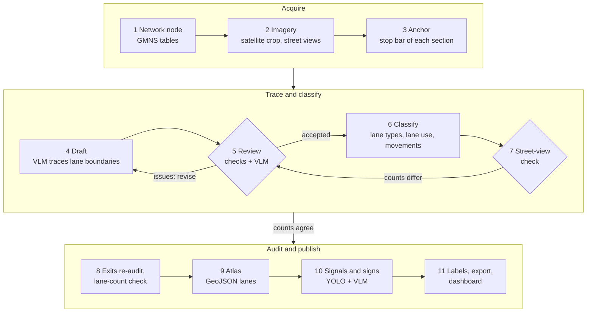

# vlm4net

Lane and turning-movement inventory for road-network intersections, read by a vision-language model (VLM) from satellite and street-level imagery.

Start from a node of a [GMNS](https://github.com/zephyr-data-specs/GMNS) network (`node.csv`, `link.csv`). The pipeline then does four things:

1. Fetches a satellite crop and Google Street View images around the junction.
2. Traces each approach and exit on the satellite crop, lane by lane.
3. Classifies every region as a motor lane, bike lane, parking, buffer and so on, and proposes the movements each lane serves.
4. Checks the result against the street views.

Every step is recorded with its images, prompts and model answers. A single-file HTML dashboard, the Intersection Explorer, shows the results beside reference data.

Model output is a prediction, not reference data.

## Example output

These figures come from the worked example in [`examples/rural_apache_7735/`](examples/rural_apache_7735/): Rural Road & Apache Boulevard in Tempe, AZ. The example folder holds everything from that run: the satellite image and street views, traced sections, lane and movement predictions, GeoJSON, annotated figures and every raw model answer.

### Labelled overview

Every region the model traced on the satellite image, labelled with its type: motor lane, bike lane, rail, buffer or parking, or unresolved. Motor lanes carry their use and number from the driver's left (L1, L2, T, R3 …). The arrows are the movements proposed from each approach into the exits.



### Lane panels per section

Each approach and exit is cut out along its own direction, with the lane labels and the movements each lane serves.



### Street views

Each approach gets Google Street View images at three distances, looking towards the junction, plus one looking back from near the stop bar. The camera's recorded position and heading tie every view to the satellite image.



While tracing, the reviewer sees the nearest street view with the current boundaries projected into it from the camera pose. The reviewer compares the projected boundaries with the painted lines in the view. A boundary that lands on no line, or a line that has no boundary, is a reason to revise the trace. The projection assumes flat ground and an approximate camera height, so it can sit up to about a lane to the side.



### YOLO

YOLO marks vehicles and people in every street view used for lane classification. The boxes go to the VLM with the image, so it knows which stretch of road is hidden behind a queue.



In the signal and sign audit, YOLO proposes traffic lights and stop signs in the context views. The VLM gets these proposals and chooses the regions it wants to see closer, YOLO's or its own, and a zoomed street view is fetched for each. YOLO's boxes are proposals only, and small heads are found with low confidence.



### Signals and signs

From the zoomed views, the VLM reads each control. It records the kind of control, the text or symbol it shows, and the box it relies on. On the northbound approach it reads a left-arrow signal head, the sign LEFT ON GREEN ARROW ONLY and a circular signal head. Each is tied to the approach. A control is tied to a single lane only when the image shows which one.



### OpenCV shade lift

Satellite crops partly in shadow get a lightened copy (contrast enhancement on lightness with OpenCV). It is shown to the model beside the original, so painted lines in the shade stay readable.



### Intersection Explorer

The ready-made dashboard for this intersection is [`dashboard/intersection_explorer_example.html`](dashboard/intersection_explorer_example.html): one 1.6 MB file holding the data, the images and the map library. Download it and open it in a browser. It shows:

- The traced lanes on the satellite image.
- Each approach's lane layout from the VLM, UTDF, OpenStreetMap and the street-view lane counts.
- The proposed movements.
- Every street view with the model's observation boxes.
- The signal and sign audit.



## Pipeline



One command runs the whole chain for a junction: `scripts/pipeline/run_site_pipeline.py`. A step whose run folder is already complete is skipped, so an interrupted run can simply be repeated. Model answers are cached, so a repeat does not pay for the same call twice. Run folders go under `runs/`; `<name>` is the run name given on the command line.

| Step | What it does | Code | Output |
|---|---|---|---|
| 1 Network node | Reads the node and the links that meet it, and works out the approaches, the exits and the arm each one lies on. | `fusion/lane_acquisition.py`, `hybrid/legs.py` | |
| 2 Imagery | Fetches the satellite crop (Mapbox Static Images) and the street views. For each approach these are forward views near, mid and far, plus a look-back near the stop bar. For each exit they look away from and back at the junction. | `acquire_site_imagery.py` | `imagery_<name>/`: `site.json`, `base_config.json`, `exit_views.json`, images |
| 3 Anchor | For each section, the VLM reads the stop bar (or the exit's crosswalk) and the carriageway edges on a probe strip. The sections on one road arm are then made to agree, and the window is placed from that reading. | `autoloop/anchor.py` | `geometry_loop_<name>/geometry/`: `anchors.json`, `plan.png` |
| 4 Draft | The VLM traces the lane boundaries on the travel-up crop. Shaded crops get an OpenCV-lightened copy. | `autoloop/geometry_stage.py`, `autoloop/render.py` | `<section>/draft/` |
| 5 Review | Geometric checks flag strips too wide or too narrow for one lane, tapers, jagged edges and strips at the crop border. A VLM review of the crop and the nearest street view follows, with the boundaries projected into the view. The findings are prompts, not verdicts; issues send the strips back for revision. | `autoloop/checks.py`, `autoloop/street_panel.py` | `<section>/round_*/`, `sections.json`, `history.json` |
| 6 Classify | Builds the classification config from the traced regions. The VLM then classifies each region and reads lane use and the lane counts in each street view, with YOLO occluder boxes. It proposes the movements, and the kerb-lane right-turn default applies unless a marking prohibits it. | `build_evidence_config_from_geometry.py`, `run_hybrid_pipeline.py`, `hybrid/` | `hybrid_pipeline_<name>/`: `lanes.json`, `movements.json`, `lane_use_audits.json`, `report.md` |
| 7 Street-view check | Approaches whose street-view lane count differs from the traced lanes go back to review once. If a section changes, classification and the later steps run again. | `street_check.py`, `autoloop/street_check.py` | `geometry/street_check.json` |
| 8 Exits, lane-count check | Re-audits each exit with views looking away from and back at the junction. Optionally, it makes one blind reading of each approach whose lane count differs from a reference movement table. | `audit_downstream.py`, `check_lane_counts.py` | `downstream_audit_<name>/`, `lane_check_<name>/` |
| 9 Atlas | Puts the lanes on the map as GeoJSON, with the rejected regions, the georeference and a report. | `build_lane_evidence_atlas.py`, `fusion/bundle.py` | `geospatial_evidence_<name>/` |
| 10 Signals and signs | Optional. YOLO proposes traffic lights and stop signs in extra street views. The VLM chooses the views to zoom into and reads each control. The findings are attached to the atlas. | `run_control_pipeline.py`, `audit_traffic_controls.py` | `control_generic_<name>/` |
| 11 Labels, export, dashboard | Draws the labelled figures (lane number, type, movement), exports the compact results, and adds the site to the single-file dashboard. | `draw_lane_labels.py`, `export_results.py`, `build_combined_dashboard.py` | `results/<name>/`, `dashboard/intersection_explorer.html` |

Scripts are in `scripts/pipeline/`, except `draw_lane_labels.py`, which is in `scripts/experiments/`. Modules are in `src/movement_fixer/`.

The pipeline has no site-specific code. Everything particular to a junction lives in its generated config. Geometry computes the measurable facts (positions, widths, headings), and the model chooses among the candidates.

The design notes in [`docs/`](docs/) are written in Chinese. [`docs/site_pipeline.md`](docs/site_pipeline.md) describes the current pipeline and the results of the batch runs.

## Models and tools

The vision-language model makes every judgement about the road. Detection and image processing only prepare its inputs. None of them counts lanes or decides a movement.

| Component | Role | Where |
|---|---|---|
| Vision-language model (default `gpt6_astra` through ASU CreateAI) | Places each section's window at the stop bar. Drafts and reviews the lane boundaries. Classifies each region. Counts the lanes in each street view. Proposes the movements. Re-audits the exits and the signals and signs. | `autoloop/`, `hybrid/`, `fusion/downstream.py`, `fusion/lane_check.py` |
| YOLO (Ultralytics `yolo26n`) | Detects cars, trucks, buses, motorcycles, bicycles and people in the street views used for lane classification. Their boxes go to the VLM with the image as potential occluders. In the signal and sign audit it proposes traffic lights and stop signs; the VLM decides what to zoom into and reads the controls itself. | `hybrid/yolo_aux.py`, `scripts/pipeline/audit_traffic_controls.py` |
| OpenCV | Image processing only. It lightens shaded satellite crops before tracing (contrast enhancement on lightness). It registers rasters (homography or affine) when the atlas is built. It measures overlaps between lane polygons in the atlas's lane graph. | `autoloop/render.py`, `fusion/registration.py`, `fusion/graph.py` |
| Geometry code | Computes the measurable facts. These are section windows and headings from the network, widths, rulers, camera positions, and street-view projections of the traced boundaries. | `autoloop/frames.py`, `autoloop/anchor.py`, `autoloop/street_panel.py`, `hybrid/legs.py` |

A lane counter based on painted lines found with OpenCV was tried and dropped. It confused the opposing carriageway with the approach, failed in shadow, and lost dashed lines under queued vehicles.

## Requirements

- Python 3.12 or newer. Development and testing used 3.14.
- Python packages: `pip install -r requirements.txt` (Pillow with AVIF support, NumPy, Requests, OpenCV, PyTorch, Ultralytics).
- YOLO weights `yolo26n.pt` from [Ultralytics](https://docs.ultralytics.com/), at `~/.cache/net2cell-vlm/weights/yolo26n.pt`. The SHA-256 is checked against the value in the site config.
- API access, set in a `.env` file at the repository root. Copy [`.env.example`](.env.example) to `.env`.
  - `CREATEAI_TOKEN` and `CREATEAI_API_URL` for the VLM. The client in `src/movement_fixer/vlm_client.py` targets ASU's CreateAI service. The default model is `gpt6_astra` (provider `openai`); set `CREATEAI_MODEL_NAME` / `CREATEAI_MODEL_PROVIDER` to change it. Another provider needs a client with the same `query_vision` interface.
  - `MAPBOX_TOKEN` for satellite imagery.
  - `GSV_API_KEY` for the Street View Static API. Image requests are billed; metadata requests are free.

## Usage

List the stages and the request budget for a node, without contacting any service:

```bash
python scripts/pipeline/run_site_pipeline.py --name site_7828 --node-id 7828 \
  --node-csv path/to/node.csv --link-csv path/to/link.csv --plan-only
```

Run a node. Billed requests must be allowed explicitly:

- `--acquire` allows the satellite and street-view image requests.
- `--audit-controls` adds the signal and sign audit.

```bash
python scripts/pipeline/run_site_pipeline.py --name site_7828 --node-id 7828 \
  --node-csv path/to/node.csv --link-csv path/to/link.csv --acquire
```

Other useful flags:

| Flag | Effect |
|---|---|
| `--cache-only` | Forbids any new request or model call. |
| `--reference-movements movement.csv` | Enables the blind lane-count check against a reference table. |
| `--refresh-outdated` | Sets aside runs made by older tracing code and reruns them, reusing their cached answers. |
| `--skip-dashboard` | Leaves the dashboard alone. |

Run a list of nodes, a few at a time. Flags after `--` go to each site run:

```bash
python scripts/pipeline/run_batch.py --sites configs/batches/asu_utdf_sites.json \
  --node-csv path/to/node.csv --link-csv path/to/link.csv --parallel 3 -- --acquire
```

Rebuild the dashboard:

```bash
python scripts/pipeline/build_combined_dashboard.py
```

The output is `dashboard/intersection_explorer.html`: one self-contained file with every intersection's data, AVIF images and the map library. Only the background map tiles need a connection. The dashboard expects the outputs of the companion UTDF/OSM project at `../net2cell_utdf` (option `--utdf-root`).

### Where things go

| Location | Contents |
|---|---|
| `runs/` | Full run folders: every intermediate image, cache and log, roughly 200 MB per junction. Set in `configs/paths.json`; `NET2CELL_RUNS_ROOT` overrides. |
| `results/<name>/` | Compact results per junction: configs, traced sections, lane and movement predictions, GeoJSON, reports, source images and annotated figures. `NET2CELL_RESULTS_ROOT` overrides. |

## What is included

The repository holds:

- Code, tests and hand-maintained configs.
- One worked example (`examples/rural_apache_7735/`) with its imagery, results and dashboard.

No other imagery, full network files, reference (UTDF) data, run folders or results are distributed. Imagery is © its providers (Mapbox and Maxar for satellite, Google for street views) and is subject to their terms.

`configs/batches/` lists the 46 intersections around Arizona State University (Tempe, AZ) used in development. `configs/utdf_node_overrides.json` records the checked matches between UTDF intersections and network nodes. `configs/pilots/` holds the pilot configuration of node 351 used by the tests.

## Tests

```bash
python -m unittest discover -s tests
```

Tests that need local imagery are skipped when it is absent.

## Repository layout

```
src/movement_fixer/   library (the package name is historical)
  autoloop/           window anchoring, draft/review tracing loop, street-view panel and check
  hybrid/             evidence config, classification, prompts, validation, YOLO, turn rules
  fusion/             acquisition, exits, controls, atlas, lane-count check
scripts/pipeline/     stage scripts and the site and batch entry points
scripts/experiments/  comparison scripts and the label drawer
configs/              batch lists, policies, UTDF node matches, pilot configs
dashboard/            dashboard template (Intersection Explorer), the example dashboard and vendored Leaflet
examples/             worked example: Rural Road & Apache Boulevard
docs/                 design notes (Chinese)
tests/                unit tests
```

## License

MIT. See [LICENSE](LICENSE).

Third-party components:

- Leaflet is vendored in `dashboard/vendor/` under its BSD-2-Clause license (`LEAFLET-LICENSE`).
- Ultralytics is a dependency, not vendored, and is licensed AGPL-3.0.
